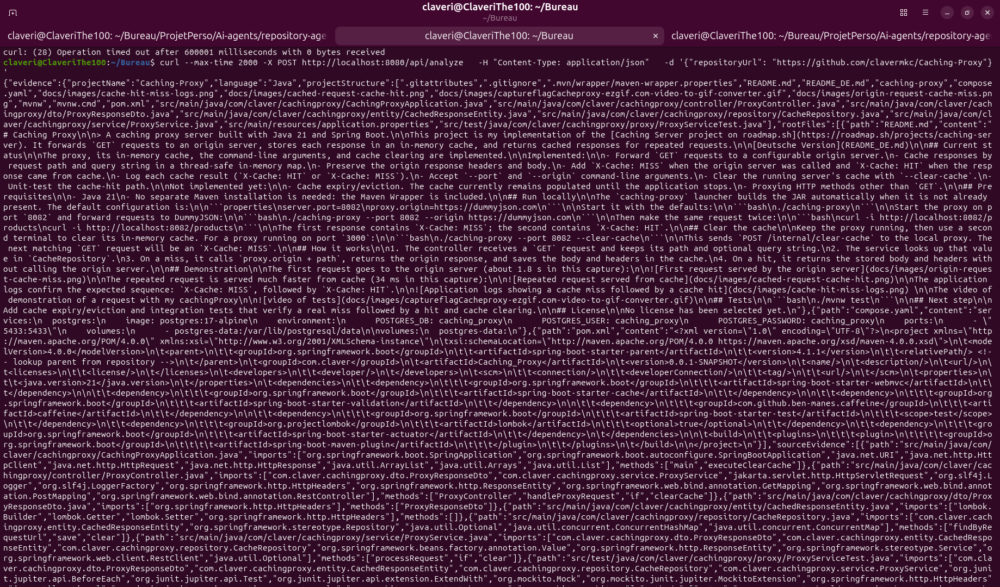

# Repository Analysis Agent

Ein intelligenter Assistent zur Analyse von GitHub-Repositorys, der mithilfe von Large Language Models (LLMs) technische Erkenntnisse (Technologien, Fähigkeiten, Projektzusammenfassung) extrahiert. Das Ziel ist die Automatisierung der Erstellung von Lebensläufen und Portfolios, indem Fähigkeiten und Projektdaten direkt aus Repositories extrahiert werden (z. B. nach einem Push).


## Wichtige Klarstellung: Was ist ein „Repository“?

In diesem Projekt bezieht sich der Begriff **Repository** auf ein **GitHub-Softwareprojekt** (z. B. `https://github.com/user/project`).


## Funktionsweise

Die Anwendung folgt einer spezialisierten „beweisbasierten Analyse-Pipeline“, um die Nutzung des LLM-Kontexts zu minimieren und gleichzeitig die Genauigkeit zu maximieren:

1.  **Abrufen (Fetching)**: Der `GitHubRepositoryService` ruft den Dateibaum und den Inhalt von einer GitHub-URL ab.
2.  **Erkennung (Detection)**: Der `ProjectLanguageDetector` identifiziert, ob es sich um ein Java-, Python-Projekt usw. handelt.
3.  **Extraktion (Extraction)**: Spezialisierte Analysatoren (z. B. `JavaProjectAnalyzer`) extrahieren „Beweise“ (Evidence) anstelle des rohen Codes.
    *   **SourceFileEvidence**: Erfasst Dateipfade, Importe und Methodensignaturen.
    *   **RootFiles**: Erfasst den vollständigen Inhalt kritischer Dateien wie `pom.xml`, `README.md` oder `Dockerfile`.
4.  **Orchestrierung (Orchestration)**: Der `AgentService` bündelt alles in einem `AnalysisContext`.
5.  **LLM-Analyse**: Der Kontext wird von `AnalysisPromptBuilder` in einen Prompt für technische Beweise formatiert und dann an ein lokales LLM (via `OllamaLlmService`) gesendet, um eine Zusammenfassung zu erstellen und Technologien zu verifizieren.

## Vorteile

*   **Inferenz-Effizienz**: Durch das Senden strukturierter „Beweise“ anstelle des vollständigen Quellcodes reduziert das System den Token-Verbrauch drastisch, was zu einer schnelleren und kostengünstigeren Analyse führt.
*   **Reduzierte Halluzinationen**: Die Verankerung des LLM in verifizierten technischen Fingerabdrücken (Importe, Methodensignaturen, Manifeste) verhindert, dass es Funktionen erfindet oder leere/irrelevante Dateien missinterpretiert.
*   **Präzision vor Rauschen**: Der Analysator filtert Rauschen und nicht verwendete Deklarationen heraus und stellt sicher, dass sich das LLM auf Technologien konzentriert, die tatsächlich in der Codebasis verwendet werden.

## Demonstration

Wenn Sie ein Repository wie [Caching-Proxy](https://github.com/clavermkc/Caching-Proxy) analysieren, erstellt der Agent eine strukturierte Ausgabe, die sowohl die technischen Beweise als auch die KI-Analyse enthält:



```json
{
  "evidence": {
    "projectName": "Caching-Proxy",
    "language": "Java",
    "projectStructure": [
      "README.md",
      "pom.xml",
      "src/main/java/com/claver/cachingproxy/CachingProxyApplication.java",
      "src/main/java/com/claver/cachingproxy/controller/ProxyController.java",
      "src/main/java/com/claver/cachingproxy/service/ProxyService.java"
    ],
    "sourceEvidence": [
      {
        "path": "src/main/java/com/claver/cachingproxy/service/ProxyService.java",
        "imports": [
          "org.springframework.stereotype.Service",
          "org.springframework.web.client.RestClient"
        ],
        "methods": ["processRequest", "clear"]
      }
    ]
  },
  "llmAnalysis": {
    "projectSummary": "Ein Caching-Proxy-Server, der mit Java 21 und Spring Boot erstellt wurde und GET-Anfragen an einen Ursprungsserver weiterleitet, jede Antwort in einem In-Memory-Cache speichert und zwischengespeicherte Antworten für wiederholte Anfragen zurückgibt.",
    "technologies": [
      { "name": "Java", "category": "Programmiersprache" },
      { "name": "Spring Boot", "category": "Framework" },
      { "name": "Caffeine", "category": "Bibliothek" }
    ],
    "skills": [
      "Implementierung eines Caching-Proxy-Servers mit Java und Spring Boot",
      "Verwendung von Caffeine für das Caching",
      "Konfiguration einer Spring Boot-Anwendung"
    ]
  }
}
```

## Projektstruktur

*   `com.example.repoanalyzer.agent`: Das „Gehirn“ des Systems. Enthält den Orchestrator (`AgentService`) und die Loader für Anweisungen.
*   `com.example.repoanalyzer.analysis`: Sprachspezifische Logik zur Extraktion technischer Fingerabdrücke (Java/Python).
*   `com.example.repoanalyzer.context`: Datentransferobjekte (Records), welche die gesammelten Beweise repräsentieren.
*   `com.example.repoanalyzer.github`: Integration mit der GitHub-API.
*   `com.example.repoanalyzer.llm`: Schnittstelle und Implementierungen für die Anbindung von KI-Modellen. Verwendet `AnalysisPromptBuilder`, um technische Beweise in LLM-Prompts zu übersetzen (Ollama wird derzeit unterstützt).
*   `com.example.repoanalyzer.web`: REST-API-Endpunkt.

## Technischer Stack

*   **Java 21**
*   **Spring Boot 4.1.1**
*   **Spring Web / RestClient**
*   **Jackson** (JSON-Verarbeitung)
*   **Ollama** (Lokale LLM-Orchestrierung)
*   **Lombok**

## Erste Schritte

### Voraussetzungen
*   JDK 21
*   Maven
*   [Ollama](https://ollama.com/) installiert und gestartet.

### Konfiguration
Konfigurieren Sie Ihre Ollama-Instanz in `src/main/resources/application.properties`:
```properties
ollama.base-url=http://localhost:11434
ollama.model=llama3.2
```

### Anwendung starten
```bash
mvn spring-boot:run
```

### Ein Repository analysieren
Senden Sie eine `POST`-Anfrage an `/api/analyze`:

```json
{
  "repositoryUrl": "https://github.com/benutzer/projekt"
}
```

## Aktueller Status
Die Pipeline ist funktionsfähig und mit **Ollama** integriert. Der Agent ruft erfolgreich Repository-Bäume ab, extrahiert technische Beweise für Java und Python und verwendet ein lokales Modell, um strukturierte technische Zusammenfassungen zu erstellen.
